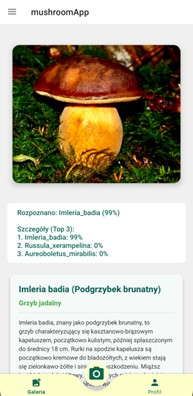
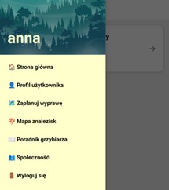
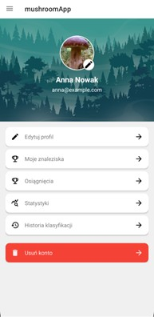
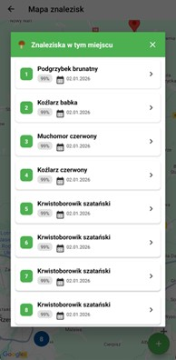
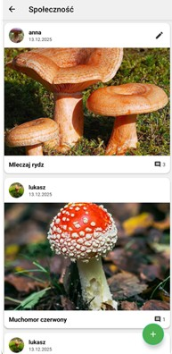

# Aplikacja mobilna do automatycznej identyfikacji grzybów

Aplikacja mobilna dla systemu Android wspierająca grzybiarzy, zaprojektowana w architekturze offline-first. System rozpoznaje 104 gatunki grzybów dzięki dwuetapowemu systemowi sztucznej inteligencji działającemu lokalnie na urządzeniu, bez konieczności połączenia z internetem. 

Projekt zrealizowany w ramach pracy inżynierskiej na kierunku Informatyka.

## O Projekcie
Głównym celem aplikacji jest wsparcie grzybiarzy w warunkach leśnych, gdzie zasięg sieci komórkowej często jest ograniczony. Aplikacja oferuje nie tylko rozpoznawanie gatunków, ale również narzędzia do zapisywania znalezisk z lokalizacją GPS, planowania wypraw oraz wbudowaną encyklopedię.

## Stack Technologiczny
* **Język:** Kotlin
* **Środowisko:** Android Studio 
* **Baza danych (Lokalna):** SQLite 
* **Baza danych (Chmura) i Backend:** Firebase (Firestore, Storage, Authentication)
* **Machine Learning:** PyTorch Mobile
* **Modele AI:** MobileNetV2 (detekcja) oraz ConvNeXtV2 (klasyfikacja)
* **Mapy:** Google Maps API

## Kluczowe Funkcjonalności
* **Rozpoznawanie offline:** Dwuetapowa detekcja bez użycia internetu (najpierw weryfikacja obecności grzyba na zdjęciu, a następnie klasyfikacja z dokładnością 87.7%).
* **Synchronizacja chmurowa:** Automatyczna synchronizacja lokalnej bazy danych SQLite z Firebase po odzyskaniu połączenia z siecią.
* **Mapa znalezisk:** Rejestrowanie współrzędnych GPS znalezisk i wyświetlanie ich na interaktywnej mapie z funkcją automatycznego grupowania (klastrowania).
* **Społeczność:** Możliwość publikowania i komentowania zdjęć znalezisk w czasie rzeczywistym (wymaga połączenia z internetem).
* **Poradnik i encyklopedia:** Wbudowana baza wiedzy o gatunkach, poradniki dla początkujących oraz zestawienie gatunków łatwych do pomylenia (działające całkowicie offline).
* **Planowanie wypraw:** Moduł do tworzenia list rzeczy do zabrania i zarządzania terminarzem wyjść do lasu.

## Galeria

> **Nota:** Pełny interfejs został oparty na zasadach Material Design.

 

*Ekran główny aplikacji z dostępem do aparatu i przydatnych narzędzi.*

 
*Karta z wynikami identyfikacji, podająca Top 3 najbardziej prawdopodobnych gatunków.*

 
*Wysuwane menu boczne pozwalające na szybką nawigację między funkcjami modułowymi zależnie od statusu logowania użytkownika.*

 
*Panel profilu zawierający statystyki aktywności, odblokowane osiągnięcia oraz historię rozpoznań.*

 
*Moduł organizacji wypraw z interaktywnymi kartami pozwalający na określenie daty, lokalizacji i listy rzeczy do zabrania.*

 
*Mapa zapisanych znalezisk wykorzystująca Google Maps API.*

 
*Baza wiedzy działająca w trybie offline, zawierająca m.in. zasady bezpieczeństwa, opisy gatunków oraz zestawienie grzybów łatwych do pomylenia.*

 
*Sekcja społecznościowa do wymiany doświadczeń między użytkownikami.*

## Architektura Uczenia Maszynowego
Zastosowano dwuetapowy proces rozpoznawania minimalizujący ryzyko błędów[cite: 1793, 1798]:
1. **Model Detekcji (MobileNetV2):** Sprawdza, czy na zdjęciu znajduje się grzyb (skuteczność 98% na zbiorze walidacyjnym).
2. **Model Klasyfikacji (ConvNeXtV2):** Rozpoznaje jeden z 104 gatunków. Model poddano optymalizacji (trening mieszanej precyzji AMP, mechanizm ArcFace Margin) i wyeksportowano do formatu TorchScript (.ptl) o rozmiarze ok. 350 MB.
