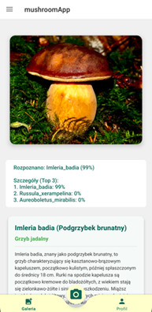
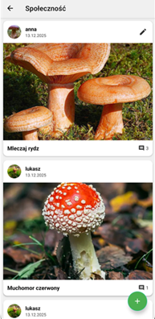

# Aplikacja mobilna do automatycznej identyfikacji grzybów

[cite_start]Aplikacja mobilna dla systemu Android wspierająca grzybiarzy, zaprojektowana w architekturze offline-first[cite: 1252, 2179]. [cite_start]System rozpoznaje 104 gatunki grzybów dzięki dwuetapowemu systemowi sztucznej inteligencji działającemu lokalnie na urządzeniu, bez konieczności połączenia z internetem[cite: 1265, 1676]. 

[cite_start]Projekt zrealizowany w ramach pracy inżynierskiej na kierunku Informatyka[cite: 2125].

## O Projekcie
[cite_start]Głównym celem aplikacji jest wsparcie grzybiarzy w warunkach leśnych, gdzie zasięg sieci komórkowej często jest ograniczony[cite: 1148]. [cite_start]Aplikacja oferuje nie tylko rozpoznawanie gatunków, ale również narzędzia do zapisywania znalezisk z lokalizacją GPS, planowania wypraw oraz wbudowaną encyklopedię[cite: 2116].

## Stack Technologiczny
* [cite_start]**Język:** Kotlin [cite: 1623]
* [cite_start]**Środowisko:** Android Studio [cite: 1622]
* [cite_start]**Baza danych (Lokalna):** SQLite [cite: 1626]
* [cite_start]**Baza danych (Chmura) i Backend:** Firebase (Firestore, Storage, Authentication) [cite: 1642, 1645, 1646]
* [cite_start]**Machine Learning:** PyTorch Mobile [cite: 1655]
* [cite_start]**Modele AI:** MobileNetV2 (detekcja) oraz ConvNeXtV2 (klasyfikacja) [cite: 1629]
* [cite_start]**Mapy:** Google Maps API [cite: 1649]

## Kluczowe Funkcjonalności
* [cite_start]**Rozpoznawanie offline:** Dwuetapowa detekcja bez użycia internetu (najpierw weryfikacja obecności grzyba na zdjęciu, a następnie klasyfikacja z dokładnością 87.7%)[cite: 1780, 1794, 1796].
* [cite_start]**Synchronizacja chmurowa:** Automatyczna synchronizacja lokalnej bazy danych SQLite z Firebase po odzyskaniu połączenia z siecią[cite: 1601, 1605].
* [cite_start]**Mapa znalezisk:** Rejestrowanie współrzędnych GPS znalezisk i wyświetlanie ich na interaktywnej mapie z funkcją automatycznego grupowania (klastrowania)[cite: 1505, 1506].
* [cite_start]**Społeczność:** Możliwość publikowania i komentowania zdjęć znalezisk w czasie rzeczywistym (wymaga połączenia z internetem)[cite: 1550, 1551, 1552].
* [cite_start]**Poradnik i encyklopedia:** Wbudowana baza wiedzy o gatunkach, poradniki dla początkujących oraz zestawienie gatunków łatwych do pomylenia (działające całkowicie offline)[cite: 1534, 1537, 1544].
* [cite_start]**Planowanie wypraw:** Moduł do tworzenia list rzeczy do zabrania i zarządzania terminarzem wyjść do lasu[cite: 1477, 1479].

## Galeria

> [cite_start]**Nota:** Pełny interfejs został oparty na zasadach Material Design[cite: 1950].

 
*Ekran główny aplikacji z dostępem do aparatu i przydatnych narzędzi.*

 
*Karta z wynikami identyfikacji, podająca Top 3 najbardziej prawdopodobnych gatunków.*

 
*Mapa zapisanych znalezisk wykorzystująca Google Maps API.*

 
*Sekcja społecznościowa do wymiany doświadczeń między użytkownikami.*

## Architektura Uczenia Maszynowego
[cite_start]Zastosowano dwuetapowy proces rozpoznawania minimalizujący ryzyko błędów[cite: 1793, 1798]:
1. [cite_start]**Model Detekcji (MobileNetV2):** Sprawdza, czy na zdjęciu znajduje się grzyb (skuteczność 98% na zbiorze walidacyjnym)[cite: 1701, 1728].
2. **Model Klasyfikacji (ConvNeXtV2):** Rozpoznaje jeden z 104 gatunków. Model poddano optymalizacji (trening mieszanej precyzji AMP, mechanizm ArcFace Margin) i wyeksportowano do formatu TorchScript (.ptl) o rozmiarze ok. [cite_start]350 MB[cite: 1736, 1743, 1744, 1772, 1790].
